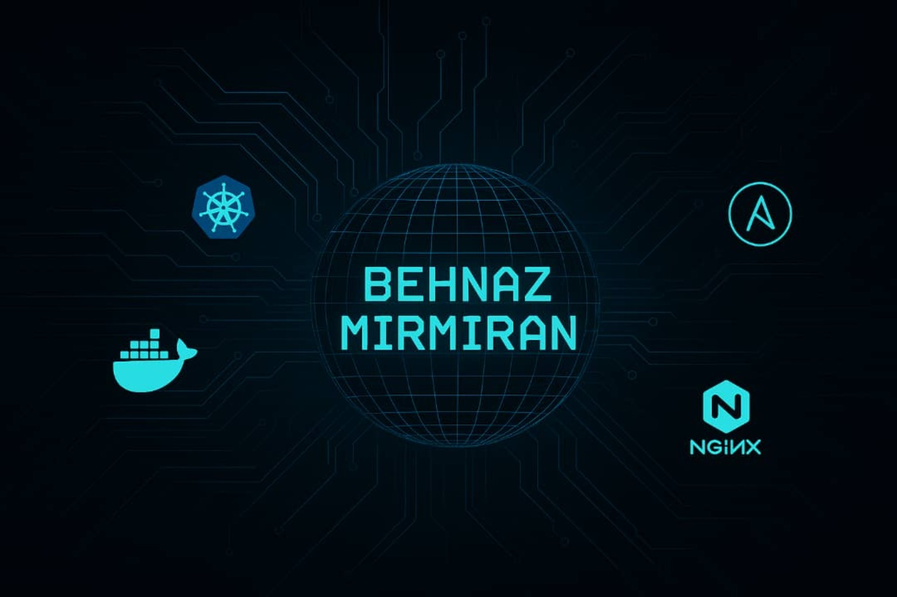

  

# 👩‍💻 Hi, I'm Behnaz Mirmiran  
Linux System Engineer | DevOps Enthusiast | Docker & Kubernetes Practitioner

🧠 Summary

I'm a Linux System Engineer and Site Reliability Engineer (SRE) with over 5 years of hands-on experience in DevOps, cloud infrastructure, and automation. I specialize in designing, deploying, and maintaining scalable systems using tools such as Docker, Kubernetes, Ansible, GitHub Actions, Prometheus, and more.

⚙️ Skilled in infrastructure-as-code (IaC), CI/CD pipelines, and container orchestration

🔒 Focused on performance, system reliability, and security in production environments

🌍 Open to new opportunities globally (relocation or remote) or locally in Iran

🤝 Passionate about learning, mentoring, and contributing to open-source projects

Currently building a portfolio of real-world DevOps projects on GitHub.

📫 Reach me on [LinkedIn](https://www.linkedin.com/in/behnaz-m-42662663)

## ⚙️ Tech Stack

## 🚀 Featured Projects

- [docker-flask-api](https://github.com/behnaz-mirmiran/docker-flask-api)
- [k8s-nginx-configmap](https://github.com/behnaz-mirmiran/k8s-nginx-configmap)
- [ansible-install-nginx](https://github.com/behnaz-mirmiran/ansible-install-nginx)
- [docker-python-scraper](https://github.com/behnaz-mirmiran/docker-python-scraper)
- and more...

## 📈 GitHub Stats

  
  

---

### 🧠 Most Used Languages

  

---

### 🔥 GitHub Streak

  

---

### 🏆 GitHub Trophies

  

---

### 📫 Let's Connect

- 💼 
- 💻 [GitHub](https://github.com/behnaz-mirmiran)
